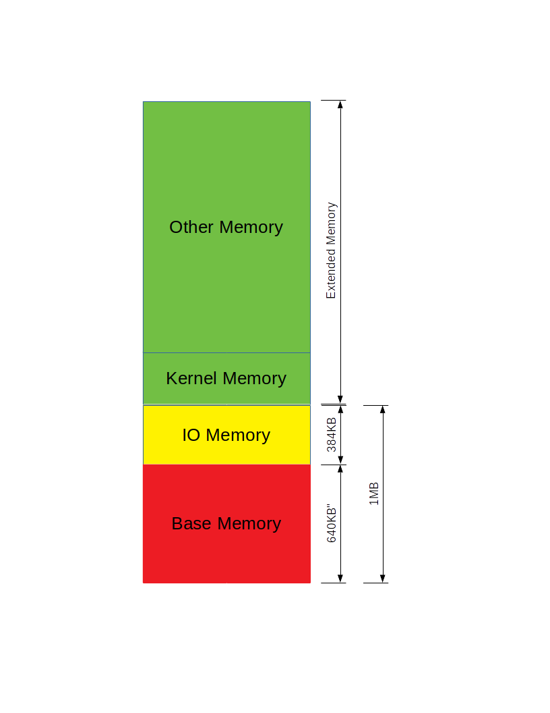

### page_init补充
```
	for(i=0; i<npages; i++){
		if(i == 0){
			pages[i].pp_ref = 1;
		} else if(i < npages_basemem){
			pages[i].pp_ref = 0;
			pages[i].pp_link = page_free_list;
			page_free_list = &pages[i];
		} else if(IOPHYSMEM / PGSIZE <= i && i < EXTPHYSMEM / PGSIZE){
			pages[i].pp_ref = 1;
		} else if(EXTPHYSMEM / PGSIZE <= i && i < PADDR(boot_alloc(0))/PGSIZE){
			pages[i].pp_ref++;
			pages[i].pp_link = NULL;
		} else {
			pages[i].pp_ref = 0;
			pages[i].pp_link = page_free_list;
			page_free_list = &pages[i];
		}
	}
```
> 这段代码一直没弄清楚，为什么范围是怎么划分的，现在做一下说明。

 
> 从图中可以看出，`Kernel Memory`包含在`Extended Memory`中，事实上也是这样的，kernel刚开始加载在`0x100000`处
```
objdump -h kernel

kernel:     file format elf32-i386

Sections:
Idx Name          Size      VMA       LMA       File off  Algn
  0 .text         000036f1  f0100000  00100000  00001000  2**4
                  CONTENTS, ALLOC, LOAD, READONLY, CODE
  1 .rodata       00001190  f0103700  00103700  00004700  2**5
                  CONTENTS, ALLOC, LOAD, READONLY, DATA
  2 .stab         00005881  f0104890  00104890  00005890  2**2
                  CONTENTS, ALLOC, LOAD, READONLY, DATA
  3 .stabstr      00001db7  f010a111  0010a111  0000b111  2**0
                  CONTENTS, ALLOC, LOAD, READONLY, DATA
  4 .data         0000a300  f010c000  0010c000  0000d000  2**12
                  CONTENTS, ALLOC, LOAD, DATA
  5 .bss          00000670  f0116300  00116300  00017300  2**5
                  ALLOC
  6 .comment      00000034  00000000  00000000  00017300  2**0
                  CONTENTS, READONLY

```
> 由提示知道, </br>
> 第0个页面: [0, PGSIZE]:存放中断向量表IDT以及BIOS的相关载入程序</br>
> 1~Base Memory:  free</br>
> IO Memory ~ Kernel Base Memory : 存放输入输出所需要的空间,比如VGA的一些显存直接映射这个地址.</br>
> Kernel Base Memory ~ boot_alloc(0) : 占用, kernel用的空间.</br>
> boot_alloc(0)~end:  free</br>
#### 疑问: 为什么是boot_alloc(0)是Kernel占用结束的位置呢?
> Initialize nextfree if this is the first time.</br>
> 'end' is a magic symbol automatically generated by the linker,</br>
>  which points to the end of the kernel's bss segment:</br>
>  the first virtual address that the linker did *not* assign</br>
>  to any kernel code or global variables.</br>
这段话的意思就是, `nextfree`一开始指向`kernel bss segment`, 切一开始`kernel bss segment`是空的，没有任何`Kernel code`和`global variable`,
`Kernel bss segment`位于`Kernel`的最末端(从上面的`objdump`出的信息也可以看出).于是我们顺理成章的找出了`kernel`结束的位置. 
